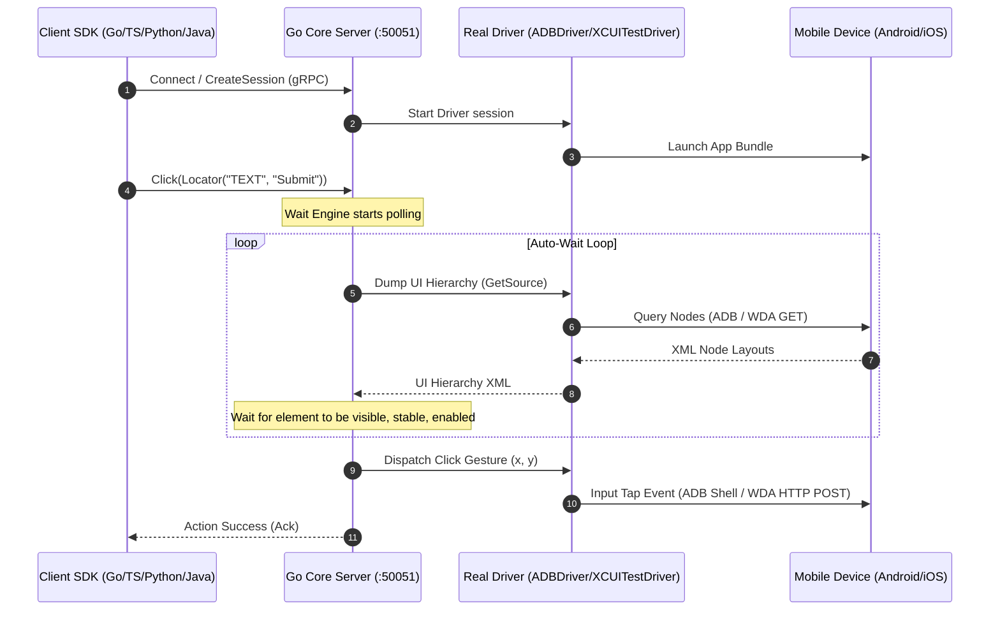

# morego

[](https://pkg.go.dev/github.com/ranjith035/morego)
[](https://goreportcard.com/report/github.com/ranjith035/morego)
[](LICENSE)

An enterprise-grade, high-performance, and resilient Mobile Automation Framework built from first principles.

`morego` is **NOT** an Appium wrapper. It is a modern client-server platform designed from the ground up to bring Playwright's legendary developer experience, execution speed, and stability to native iOS and Android applications.

---

## 🚀 Key Pillars & Core Value

Mobile automation is historically divided between two paradigms:
1.  **Appium:** Programmatic, multi-language, and flexible—but slow, complex to set up, and prone to flaky tests due to legacy HTTP WebDriver protocol overhead.
2.  **Maestro:** Fast, reliable, and low-flakiness—but restricted to static YAML files, making complex test flows (loops, database seeding, API mocking, conditional actions) difficult to implement.

`morego` bridges this gap: it combines **Maestro-grade execution stability and speed** with **Playwright-style programmatic multi-language SDKs** (Go, TypeScript/JavaScript, Python, and Java) and premium interactive debugging tooling.

---

## 📐 High-Level Architecture

All SDK languages act as thin, logic-free serialization layers. Element wait routines, spatial locating algorithms, and hardware driver coordination are centralized in a high-performance **Go Core Engine**. The SDKs and Core communicate using bi-directional streaming via **gRPC and Protocol Buffers**.



---

## 📦 System Features

### 💻 1. Multi-Language Client SDKs (`/sdk`)
Contains **no automation logic**. Exposes standard native client packages for **Go**, **TypeScript (Node.js)**, **Python**, and **Java (Maven)**. Clicks and text inputs perform a two-step delegation: resolving queries to W3C Element UUID tags via `FindElement` calls, then executing interactions on the resolved elements over gRPC.

### 🔌 2. Native Drivers (`/drivers`)
*   **Android (`drivers/adb.go`):** Spawns native `adb` command processes. Extracts layout XML streams to `/data/local/tmp/`, calculates layout bounds center coordinates, inputs keyboard text via `adb shell input text`, and captures frame screen buffers natively via `adb exec-out screencap -p`.
*   **iOS (`drivers/xcuitest.go`):** Dialing a native HTTP REST client to Apple's **WebDriverAgent (WDA)** server running on the device. Resolves XPath/Class selectors to W3C Element ID wrappers and drives touch gestures, inputs, and screenshot frame captures.

### ⏱️ 3. Non-Blocking Auto-Wait (`/core`)
Intelligently waits for element attachments, visibility states, and layout stability (evaluating coordinate bounds matches across ticks using `time.Ticker` channel frames) before executing gestures, eliminating flaky sleeps.

### ✨ 4. AI-Driven Self-Healing & Auditing (`/ai`)
*   **Self-Healing:** If an element selector fails (due to layout modifications or text edits), the AI compares the broken selector and past node history profiles against the current view tree, computes a composite similarity match score, and heals the locator on-the-fly.
*   **Accessibility Auditing & Suggestions:** Scans layout structures to query AI-recommended locators based on stable element properties.

### 🖥️ 5. Interactive Web Inspector (`/inspector`)
A high-fidelity developer dashboard that simulates mobile canvas element picking. Hovering nodes highlights matching entries in the XML UI Hierarchy tree, provides AI healed locator recommendations (with confidence percentages), and generates runnable SDK test scripts in real-time.

### 📊 6. Telemetry Reporting (`/reporter`)
Exports logs, execution steps, base64 screenshots, and SVG charts plotting CPU (%) and RAM (MB) usage over time to JSON, JUnit XML (ready for CI integrations), and interactive HTML dashboards.

---

## 📂 Repository Layout

```
morego/
├── docs/               # Architecture decision records, vision, and governance
├── proto/              # Protocol Buffer (.proto) definitions & generated Go stubs
├── core/               # Central DI Container, Wait Engine, and Assertion Engine
├── drivers/            # ADB shell and WebDriverAgent HTTP REST controllers
├── sdk/                # Multi-Language Client SDK Bindings
│   ├── client.go       # Go Client core wrapper
│   ├── typescript/     # Node.js typescript SDK
│   ├── python/         # Python 3 SDK
│   ├── java/           # Java 17 Maven SDK
│   └── sample/         # Go executable sample test
├── cmd/                # Entrypoint starting the Go Core gRPC Server
├── grid/               # SaaS Cloud farm allocator, RBAC manager, and MJPEG broadcaster
├── ai/                 # Self-healing tree similarity calculators and accessibility audits
├── recorder/           # Action IR buffers and polyglot code translators
├── reporter/           # JUnit, JSON, and HTML interactive report compilers
├── Makefile            # Build, test, and generation scripts
└── Dockerfile          # Engine deployment wrapper
```

---

## 🚦 Getting Started & Quickstart

### 📋 Prerequisites
*   [Go](https://go.dev/doc/install) v1.22+
*   **Android:** ADB CLI installed on your machine (`adb devices` must see your device).
*   **iOS:** WebDriverAgent Xcode scheme launched on your iOS Simulator/Device.

### 🛠️ 1. Building and Running the Core Server
Initialize Go Workspace modules:
```bash
make init
```

Compile the gRPC server:
```bash
go build -o bin/morego.exe ./cmd/main.go
```

Start the gRPC Server listening on port `50051`:
```bash
./bin/morego.exe
```

### 🏃 2. Running a Test Session (Pick Your Language)

With your device connected and the `morego` server running:

#### 🐹 Go Client
```bash
go run ./sdk/sample/main.go
```

#### 🐍 Python Client
```bash
pip install grpcio grpcio-tools
python sdk/python/sample.py
```

#### 🦺 TypeScript Client
```bash
cd sdk/typescript
npm install
npm run build
node sample.js
```

#### ☕ Java Client
```bash
cd sdk/java
mvn clean compile exec:java -Dexec.mainClass="com.morego.sdk.sample.Sample"
```

---

## 📖 Step-by-Step Examples

### 🤖 Example 1: Go (ADB) Automation
```go
package main

import (
	"context"
	"fmt"
	"time"

	"github.com/ranjith035/morego/sdk"
)

func main() {
	ctx := context.Background()

	// 1. Connect to morego core server
	device, err := sdk.Connect(ctx, "localhost:50051", "pixel_6_pro")
	if err != nil {
		panic(err)
	}
	defer device.Close()

	// 2. Start a Settings app session
	session, err := device.NewSession(ctx, "com.android.settings", nil)
	if err != nil {
		panic(err)
	}
	defer session.Close(ctx)

	// 3. Swipe gesture
	_ = session.Swipe(ctx, 500, 1500, 500, 500, 400*time.Millisecond)

	// 4. Locate and Click search bar
	searchBar := session.Locator("RESOURCE_ID", "com.android.settings:id/search_action_bar")
	if err := searchBar.Click(ctx); err == nil {
		// 5. Fill input
		searchVal := session.Locator("CLASS_NAME", "android.widget.EditText")
		_ = searchVal.Fill(ctx, "Wi-Fi")
	}
}
```

### 🦺 Example 2: TypeScript/Node.js Automation
```typescript
import { Device } from './dist';

async function main() {
  const device = await Device.connect("localhost:50051", "pixel_6_pro");

  try {
    const session = await device.newSession("com.android.settings");
    await session.swipe(500, 1500, 500, 500, 400);

    const searchBar = session.locator("RESOURCE_ID", "com.android.settings:id/search_action_bar");
    await searchBar.click();

    const searchInput = session.locator("CLASS_NAME", "android.widget.EditText");
    await searchInput.fill("Wi-Fi");
  } finally {
    device.close();
  }
}

main().catch(console.error);
```

### 🐍 Example 3: Python Automation
```python
from morego import Device

def main():
    device = Device.connect("localhost:50051", "pixel_6_pro")
    try:
        session = device.new_session("com.android.settings")
        session.swipe(500, 1500, 500, 500, 400)

        search_bar = session.locator("RESOURCE_ID", "com.android.settings:id/search_action_bar")
        search_bar.click()

        search_input = session.locator("CLASS_NAME", "android.widget.EditText")
        search_input.fill("Wi-Fi")
    finally:
        device.close()

if __name__ == "__main__":
    main()
```

### ☕ Example 4: Java (Maven) Automation
```java
package com.morego.sdk.sample;

import com.morego.sdk.Device;
import com.morego.sdk.Session;
import com.morego.sdk.Locator;

public class Sample {
    public static void main(String[] args) {
        try (Device device = Device.connect("localhost:50051", "pixel_6_pro")) {
            Session session = device.newSession("com.android.settings");
            session.swipe(500, 1500, 500, 500, 400);

            Locator searchBar = session.locator("RESOURCE_ID", "com.android.settings:id/search_action_bar");
            searchBar.click();

            Locator searchInput = session.locator("CLASS_NAME", "android.widget.EditText");
            searchInput.fill("Wi-Fi");
        } catch (Exception e) {
            e.printStackTrace();
        }
    }
}
```

### 📐 Example 5: Spatial Relative Locating
Find elements relative to other visual elements on the screen:
```go
// Find a target input box that is located ABOVE a specific submit button
submitButton := session.Locator("RESOURCE_ID", "com.example.login:id/btn_submit")
emailInput := session.Locator("CLASS_NAME", "android.widget.EditText").Above(submitButton)

_ = emailInput.Fill(ctx, "user@example.com")
```

### 🧠 Example 6: AI-Suggested Stable Locators
Query the AI engine to get suggestions for alternative stable and robust locators:
```go
xmlSource, _ := session.GetSource(ctx, "xml")

suggestions, err := device.SuggestLocators(ctx, xmlSource)
if err == nil {
	for _, s := range suggestions {
		fmt.Printf("Suggested Selector: %s (Strategy: %s, Stability Score: %0.2f)\n",
			s.Selector, s.Strategy, s.StabilityScore)
	}
}
```

---

## 🤝 Contributing & Open Source Roadmap

We welcome and appreciate all contributions! `morego` is built from first principles with a clean dependency-injection design, making it highly modular and easy for new developers to explore and extend.

### 🗺️ Our Active Roadmap (Areas to Contribute)
*   **🐍 Multi-Language Client SDKs:** Add more helper functions and properties to TypeScript, Python, and Java wrappers.
*   **🖱️ Custom Desktop Drivers:** Extend the driver registry to support macOS / Windows desktop application automation.
*   **🤖 Advanced AI Healing Models:** Train and integrate semantic similarity heaters to match elements by natural language labels.
*   **📊 Custom Dashboard Exporters:** Add new reporting adapters (Slack alerts, PDF exporters, or visual regression comparisons).

### 🛠️ Setting Up for Contribution
1. Fork and clone the repository.
2. Verify all unit tests compile and run:
   ```bash
   go test ./...
   ```
3. Run code formatting and verification:
   ```bash
   make fmt
   make lint
   ```
4. Read our comprehensive [Contributing Guidelines](docs/contributing.md).

---

## 📄 License

Distributed under the Apache 2.0 License. See [LICENSE](LICENSE) for details.
