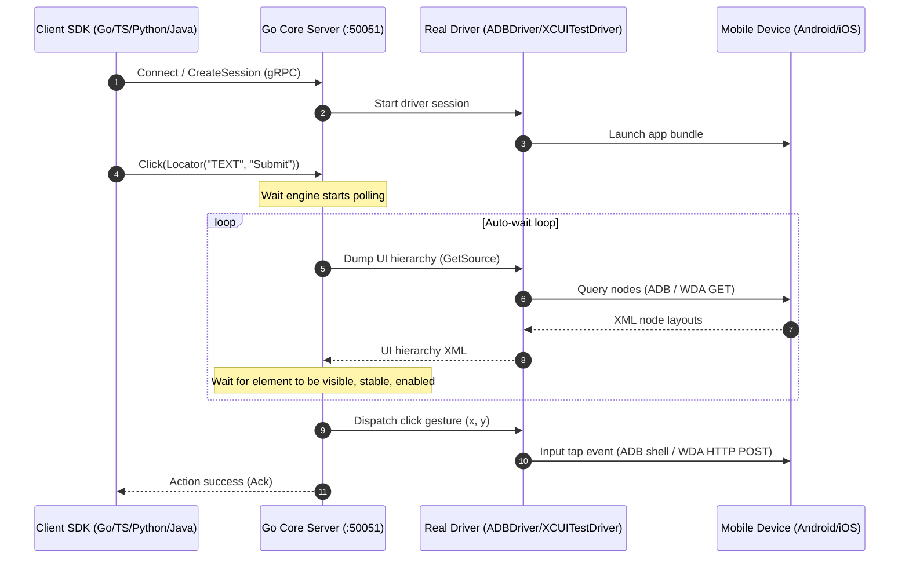

# morego

[](https://pkg.go.dev/github.com/ranjith035/morego)
[](https://goreportcard.com/report/github.com/ranjith035/morego)
[](LICENSE)

An enterprise-grade, high-performance, and resilient mobile automation framework built from first principles.

`morego` is not an Appium wrapper. It is a modern client-server platform designed from the ground up to bring Playwright's developer experience, execution speed, and stability to native iOS and Android applications.

---

## Key Pillars and Core Value

Mobile automation is historically divided between two paradigms:

1. **Appium:** Programmatic, multi-language, and flexible, but slow, complex to set up, and prone to flaky tests due to legacy HTTP WebDriver overhead.
2. **Maestro:** Fast, reliable, and low-flakiness, but restricted to static YAML files, which makes complex flows like loops, database seeding, API mocking, and conditionals difficult.

`morego` aims to bridge this gap by combining Maestro-grade execution stability and speed with Playwright-style programmatic multi-language SDKs and premium debugging tooling.

---

## High-Level Architecture

All SDK languages act as thin, logic-free serialization layers. Element wait routines, spatial locating algorithms, and hardware driver coordination are centralized in a high-performance Go core engine. The SDKs and core communicate using gRPC and Protocol Buffers.



---

## System Features

### 1. Multi-Language Client SDKs (`/sdk`)

Contains no automation logic. Exposes native client packages for Go, TypeScript/JavaScript, Python, and Java. Clicks and text inputs perform a two-step delegation: resolve queries to W3C element IDs via `FindElement`, then execute interactions on the resolved elements over gRPC.

### 2. Native Drivers (`/drivers`)

- **Android (`drivers/adb.go`):** Spawns native `adb` commands, extracts layout XML to `/data/local/tmp/`, calculates layout-bound centers, enters text with `adb shell input text`, and captures screenshots via `adb exec-out screencap -p`.
- **iOS (`drivers/xcuitest.go`):** Communicates with Apple's WebDriverAgent (WDA) over HTTP, resolves selectors to W3C element IDs, and drives taps, typing, swipes, and screenshots.

### 3. Non-Blocking Auto-Wait (`/core`)

Waits for attachment, visibility, and layout stability before actions execute, reducing the need for brittle sleeps.

### 4. AI-Driven Self-Healing and Auditing (`/ai`)

- **Self-healing:** If a selector breaks, the AI compares the failing locator and historical node data against the current tree and proposes a healed locator.
- **Accessibility auditing and suggestions:** Scans layouts to recommend more stable locators based on durable element properties.

### 5. Interactive Web Inspector (`/inspector`)

A developer dashboard for hierarchy inspection, element picking, AI locator suggestions, and runnable SDK code generation.

### 6. Telemetry Reporting (`/reporter`)

Exports logs, execution steps, screenshots, and resource charts to JSON, JUnit XML, and HTML dashboards.

---

## Repository Layout

```text
morego/
|-- docs/               # Architecture decision records, vision, and governance
|-- proto/              # Protocol Buffer definitions and generated Go stubs
|-- core/               # Central DI container, wait engine, and assertion engine
|-- drivers/            # ADB shell and WebDriverAgent controllers
|-- sdk/                # Multi-language client SDK bindings
|   |-- client.go       # Go client core wrapper
|   |-- typescript/     # Node.js TypeScript SDK
|   |-- python/         # Python 3 SDK
|   |-- java/           # Java 17 Maven SDK
|   `-- sample/         # Go executable sample test
|-- cmd/                # Entrypoint for the Go core gRPC server
|-- grid/               # Cloud farm allocator, RBAC manager, and MJPEG broadcaster
|-- ai/                 # Self-healing and accessibility analysis
|-- recorder/           # Action IR buffers and polyglot code translators
|-- reporter/           # JUnit, JSON, and HTML report compilers
|-- Makefile            # Build, test, and generation scripts
`-- Dockerfile          # Engine deployment wrapper
```

---

## Getting Started

### Prerequisites

- [Go](https://go.dev/doc/install) v1.22+
- **Android:** ADB CLI installed and able to see your device with `adb devices`
- **iOS:** WebDriverAgent running on your simulator or device

### 1. Build and Run the Core Server

Initialize the Go workspace modules:

```bash
make init
```

Compile the gRPC server:

```bash
go build -o bin/morego.exe ./cmd/main.go
```

Start the server on port `50051`:

```bash
./bin/morego.exe
```

### 2. Run a Test Session

With your device connected and the `morego` server running:

#### Go Client

```bash
go run ./sdk/sample/main.go
```

#### Python Client

```bash
pip install grpcio grpcio-tools
python sdk/python/sample.py
```

#### TypeScript Client

```bash
cd sdk/typescript
npm install
npm run build
node sample.js
```

#### Java Client

```bash
cd sdk/java
mvn clean compile exec:java -Dexec.mainClass="com.morego.sdk.sample.Sample"
```

---

## Step-by-Step Examples

### Example 1: Go (ADB) Automation

```go
package main

import (
	"context"
	"fmt"
	"time"

	"github.com/ranjith035/morego/sdk"
)

func main() {
	ctx := context.Background()

	device, err := sdk.Connect(ctx, "localhost:50051", "pixel_6_pro")
	if err != nil {
		panic(err)
	}
	defer device.Close()

	session, err := device.NewSession(ctx, "com.android.settings", nil)
	if err != nil {
		panic(err)
	}
	defer session.Close(ctx)

	_ = session.Swipe(ctx, 500, 1500, 500, 500, 400*time.Millisecond)

	searchBar := session.Locator("RESOURCE_ID", "com.android.settings:id/search_action_bar")
	if err := searchBar.Click(ctx); err == nil {
		searchVal := session.Locator("CLASS_NAME", "android.widget.EditText")
		_ = searchVal.Fill(ctx, "Wi-Fi")
	}
}
```

### Example 2: TypeScript/Node.js Automation

```typescript
import { Device } from './dist';

async function main() {
  const device = await Device.connect("localhost:50051", "pixel_6_pro");

  try {
    const session = await device.newSession("com.android.settings");
    await session.swipe(500, 1500, 500, 500, 400);

    const searchBar = session.locator("RESOURCE_ID", "com.android.settings:id/search_action_bar");
    await searchBar.click();

    const searchInput = session.locator("CLASS_NAME", "android.widget.EditText");
    await searchInput.fill("Wi-Fi");
  } finally {
    device.close();
  }
}

main().catch(console.error);
```

### Example 3: Python Automation

```python
from morego import Device

def main():
    device = Device.connect("localhost:50051", "pixel_6_pro")
    try:
        session = device.new_session("com.android.settings")
        session.swipe(500, 1500, 500, 500, 400)

        search_bar = session.locator("RESOURCE_ID", "com.android.settings:id/search_action_bar")
        search_bar.click()

        search_input = session.locator("CLASS_NAME", "android.widget.EditText")
        search_input.fill("Wi-Fi")
    finally:
        device.close()

if __name__ == "__main__":
    main()
```

### Example 4: Java Automation

```java
package com.morego.sdk.sample;

import com.morego.sdk.Device;
import com.morego.sdk.Session;
import com.morego.sdk.Locator;

public class Sample {
    public static void main(String[] args) {
        try (Device device = Device.connect("localhost:50051", "pixel_6_pro")) {
            Session session = device.newSession("com.android.settings");
            session.swipe(500, 1500, 500, 500, 400);

            Locator searchBar = session.locator("RESOURCE_ID", "com.android.settings:id/search_action_bar");
            searchBar.click();

            Locator searchInput = session.locator("CLASS_NAME", "android.widget.EditText");
            searchInput.fill("Wi-Fi");
        } catch (Exception e) {
            e.printStackTrace();
        }
    }
}
```

### Example 5: Spatial Relative Locating

```go
submitButton := session.Locator("RESOURCE_ID", "com.example.login:id/btn_submit")
emailInput := session.Locator("CLASS_NAME", "android.widget.EditText").Above(submitButton)

_ = emailInput.Fill(ctx, "user@example.com")
```

### Example 6: AI-Suggested Stable Locators

```go
xmlSource, _ := session.GetSource(ctx, "xml")

suggestions, err := device.SuggestLocators(ctx, xmlSource)
if err == nil {
	for _, s := range suggestions {
		fmt.Printf("Suggested Selector: %s (Strategy: %s, Stability Score: %0.2f)\n",
			s.Selector, s.Strategy, s.StabilityScore)
	}
}
```

---

## Contributing and Roadmap

We welcome contributions. `morego` is built with a dependency-injection-first design so contributors can explore and extend it without having to untangle a monolith.

### Active Roadmap Areas

- **Multi-language client SDKs:** Add more helpers and ergonomic APIs to the TypeScript, Python, and Java SDKs.
- **Custom desktop drivers:** Extend the driver registry to support macOS and Windows desktop automation.
- **Advanced AI healing models:** Improve semantic similarity and natural-language matching.
- **Custom dashboard exporters:** Add new reporting adapters such as Slack alerts, PDFs, or visual regression outputs.

### Setting Up for Contribution

1. Fork and clone the repository.
2. Verify all unit tests compile and run:
   ```bash
   go test ./...
   ```
3. Run formatting and verification:
   ```bash
   make fmt
   make lint
   ```
4. Read the [Contributing Guidelines](docs/contributing.md).

---

## License

Distributed under the Apache 2.0 License. See [LICENSE](LICENSE) for details.
