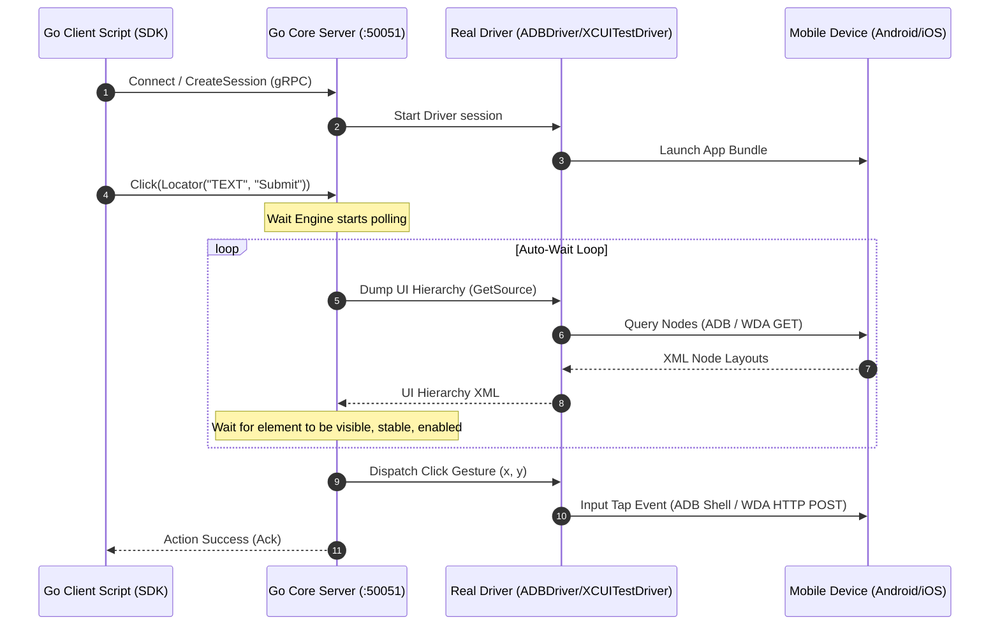

# morego

[](https://pkg.go.dev/github.com/ranjith035/morego)
[](https://goreportcard.com/report/github.com/ranjith035/morego)
[](LICENSE)

An enterprise-grade, high-performance, and resilient Mobile Automation Framework built from first principles.

`morego` is **NOT** an Appium wrapper. It is a modern client-server platform designed from the ground up to bring Playwright's legendary developer experience, execution speed, and stability to native iOS and Android applications.

---

## 🚀 Key Pillars & Core Value

Mobile automation is historically divided between two paradigms:
1.  **Appium:** Programmatic, multi-language, and flexible—but slow, complex to set up, and prone to flaky tests due to legacy HTTP WebDriver protocol overhead.
2.  **Maestro:** Fast, reliable, and low-flakiness—but restricted to static YAML files, making complex test flows (loops, database seeding, API mocking, conditional actions) difficult to implement.

`morego` bridges this gap: it combines **Maestro-grade execution stability and speed** with **Playwright-style programmatic multi-language SDKs** (Go, TypeScript, Python, C#, Java, Kotlin) and premium interactive debugging tooling.

---

## 📐 High-Level Architecture

All SDK languages act as thin, logic-free serialization layers. Element wait routines, spatial locating algorithms, and hardware driver coordination are centralized in a high-performance **Go Core Engine**. The SDKs and Core communicate using bi-directional streaming via **gRPC and Protocol Buffers**.



---

## 📦 System Features

### 💻 1. Thin Client SDKs (`/sdk`)
Contains **no automation logic**. All client APIs (Device, Session, Locator) serialize queries and dispatch them as gRPC frames. Clicks and text inputs perform a two-step delegation: resolving queries to W3C Element UUID tags via `FindElement` calls, then executing interactions on the resolved elements.

### 🔌 2. Native Drivers (`/drivers`)
*   **Android (`drivers/adb.go`):** Spawns native `adb` command processes. Extracts layout XML streams to `/data/local/tmp/`, calculates layout bounds center coordinates, inputs keyboard text via `adb shell input text`, and captures frame screen buffers natively via `adb exec-out screencap -p`.
*   **iOS (`drivers/xcuitest.go`):** Dialing a native HTTP REST client to Apple's **WebDriverAgent (WDA)** server running on the device. Resolves XPath/Class selectors to W3C Element ID wrappers and drives touch gestures, inputs, and screenshot frame captures.

### ⏱️ 3. Non-Blocking Auto-Wait (`/core`)
Intelligently waits for element attachments, visibility states, and layout stability (evaluating coordinate bounds matches across ticks using `time.Ticker` channel frames) before executing gestures, eliminating flaky sleeps.

### ✨ 4. AI-Driven Self-Healing & Auditing (`/ai`)
*   **Self-Healing:** If an element selector fails (due to layout modifications or text edits), the AI compares the broken selector and past node history profiles against the current view tree, computes a composite similarity match score, and heals the locator on-the-fly.
*   **Accessibility Auditing:** Scans layouts and flags clickable buttons missing content descriptions (Severity: High) or text fields missing placeholder tags (Severity: Medium).

### 🖥️ 5. Interactive Web Inspector (`/inspector`)
A high-fidelity developer dashboard that simulates mobile canvas element picking. Hovering nodes highlights matching entries in the XML UI Hierarchy tree, provides AI healed locator recommendations (with confidence percentages), and generates runnable SDK test scripts in real-time.

### 📊 6. Telemetry Reporting (`/reporter`)
Exports logs, execution steps, base64 screenshots, and SVG charts plotting CPU (%) and RAM (MB) usage over time to JSON, JUnit XML (ready for CI integrations), and interactive HTML dashboards.

---

## 📂 Repository Layout

```
morego/
├── docs/               # Architecture decision records, vision, and governance
├── proto/              # Protocol Buffer (.proto) definitions & generated Go stubs
├── core/               # Central DI Container, Wait Engine, and Assertion Engine
├── drivers/            # ADB shell and WebDriverAgent HTTP REST controllers
├── sdk/                # Fluent client SDK and runnable local sample script
├── cmd/                # Entrypoint starting the Go Core gRPC Server
├── grid/               # SaaS Cloud farm allocator, RBAC manager, and MJPEG broadcaster
├── ai/                 # Self-healing tree similarity calculators and accessibility audits
├── recorder/           # Action IR buffers and polyglot code translators
├── reporter/           # JUnit, JSON, and HTML interactive report compilers
├── Makefile            # Build, test, and generation scripts
└── Dockerfile          # Engine deployment wrapper
```

---

## 🚦 Getting Started

### 📋 Prerequisites
*   [Go](https://go.dev/doc/install) v1.22+
*   [Protocol Buffers Compiler (protoc)](https://protobuf.dev/) (Pre-downloaded executable helper included in workspace)
*   **Android:** ADB CLI installed on your machine (`adb devices` must see your device).
*   **iOS:** WebDriverAgent Xcode scheme launched on your iOS Simulator/Device.

### 🛠️ 1. Building the Core Server
Initialize Go Workspace modules:
```bash
make init
```

Compile the gRPC server:
```bash
go build -o bin/morego.exe ./cmd/main.go
```

Start the gRPC Server listening on port `50051`:
```bash
./bin/morego.exe
```

### 🏃 2. Running a Test Session
With your device connected and the server running, launch the reference test client script:
```bash
go run ./sdk/sample/main.go
```
*This script connects to the server, starts a session on your device, executes swipe gestures, clicks search bar inputs, and enters text queries.*

### 🧪 3. Running Workspace Tests
Execute unit and integration tests across all modules:
```bash
go test ./...
```

Ensure formatting compliance:
```bash
make fmt
make lint
```

---

## 📄 License

Distributed under the Apache 2.0 License. See [LICENSE](LICENSE) for details.
