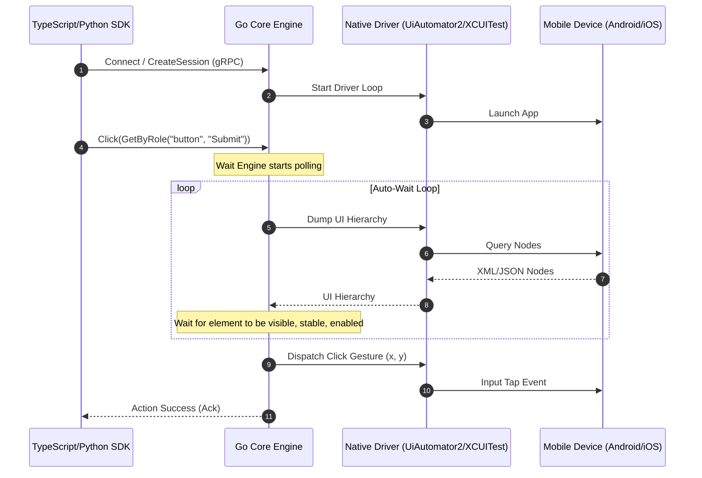

# Mobile Automation Platform

An open-source, Playwright-inspired mobile automation framework built from first principles.

> [!NOTE]
> This framework is **NOT** another Appium wrapper. It is a modern, high-performance platform designed from the ground up to bring Playwright's legendary developer experience to native iOS and Android applications.

---

## Why a New Framework?

Mobile automation is currently divided between two paradigms:
1.  **Appium:** Extremely flexible and programmatic across multiple languages, but slow, complex to set up, and prone to flaky tests due to legacy HTTP WebDriver design.
2.  **Maestro:** Fast, reliable, and low-flakiness, but restricted to declarative YAML configurations, making complex test scenarios (loops, database seeding, API mocking) painful to implement.

This platform bridges the gap: it combines **Maestro-grade execution stability and speed** with **Playwright-style programmatic multi-language SDKs** (TypeScript, Python, Go, Java, etc.) and premium tooling (Inspector, Recorder, Trace Viewer).

---

## High-Level Architecture

All SDK languages act as thin serialization layers. Automation logic, element wait routines, and driver coordination are centralized in a high-performance **Go Core Engine**. The SDKs and Core communicate using bi-directional streaming via **gRPC and Protocol Buffers**.



---

## Directory Layout

```
mobile-framework/
├── docs/               # System documentation & guidelines
│   ├── architecture/   # Structural diagrams and components
│   ├── vision/         # Mission and roadmap
│   ├── adr/            # Architecture Decision Records
│   └── engineering_guidelines.md
├── proto/              # Protocol Buffer (.proto) definitions (Phase 2)
├── core/               # Go Core Engine implementation (Phase 3)
├── drivers/            # Native driver wrappers (Phase 4)
├── sdk/                # Multi-language client bindings (Phase 11)
├── cmd/                # Entrypoints for the core CLI
├── pkg/                # Shared utilities and helper packages
├── Makefile            # Build orchestration
└── Dockerfile          # Engine deployment package
```

---

## Getting Started

### Prerequisites
*   [Go](https://go.dev/doc/install) v1.22+
*   [Make](https://www.gnu.org/software/make/)

### Building the Core Engine
Initialize your local Go Workspace:
```bash
make init
```

Compile the CLI binary:
```bash
make build
```
The compiled binary will be generated under `bin/mobile`.

### Formatting and Code Quality
Ensure your contributions follow our coding style guidelines:
```bash
make fmt
make lint
```

### Running Tests
Run all unit and integration tests:
```bash
make test
```

---

## License

Distributed under the Apache 2.0 License. See [LICENSE](file:///c:/Users/ranji/OneDrive/Desktop/MobileAutomation/LICENSE) for details.
