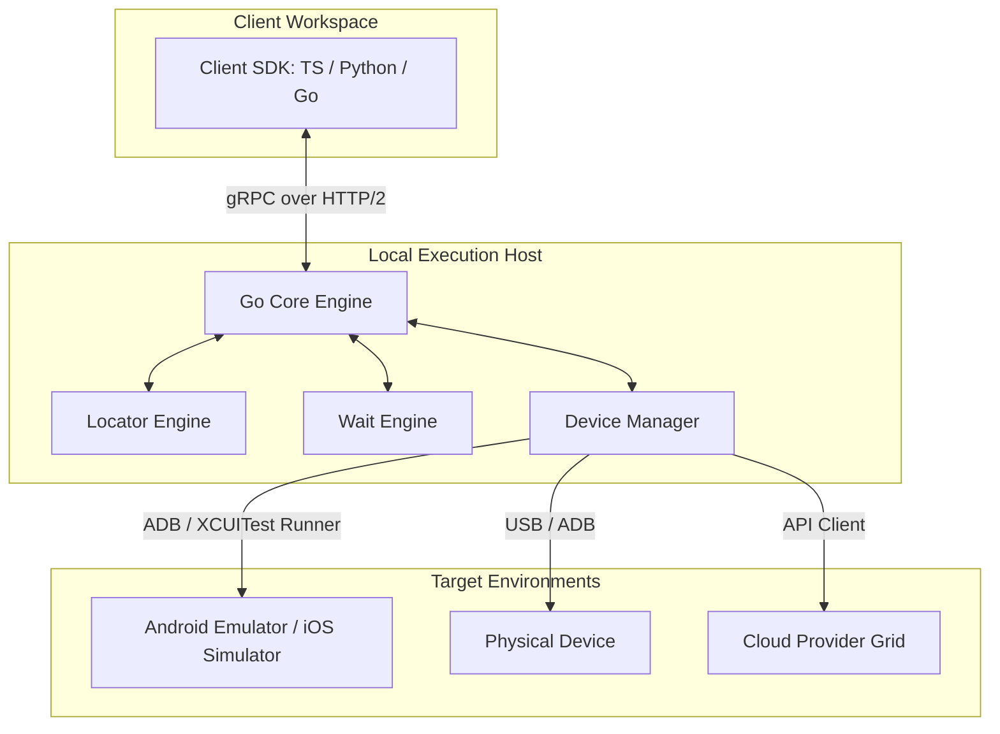

# Architectural Overview

This document describes the high-level architecture of our Playwright-inspired mobile automation platform.

---

## 1. System Topology

Our system topology separates test definition (client SDK), execution orchestration (Go core engine), and on-device interaction (drivers):

---

## 2. Core Components

The framework is organized into separate, highly decoupled components implemented in the Go core engine:

### 2.1. Central Session Manager
*   Manages the lifecycle of automation sessions.
*   Maps a client connection (SDK) to a unique session context.
*   Handles clean teardown and resource release upon disconnection.

### 2.2. Locator Engine
*   Evaluates element search queries.
*   Supports accessibility-first query functions: `GetByRole`, `GetByLabel`, `GetByPlaceholder`, `GetByText`, and `GetByTestId`.
*   Applies a strict locator ranking model to prefer structural accessibility tags over brittle paths.

### 2.3. Auto-Wait Engine
*   Intercepts actions (like `Click` or `Fill`) and polls target elements to confirm readiness.
*   Checks for the following states before firing events:
    *   **Attached:** Present in the view hierarchy.
    *   **Visible:** Rendered on screen (non-zero width/height, not hidden).
    *   **Stable:** Element position and bounding box are not animating.
    *   **Enabled:** Not marked disabled in the native UI schema.
    *   **Clickable:** Not blocked by overlapping system overlays or dialogs.

### 2.4. Action Engine
*   Translates high-level inputs (e.g., tap, text entry, swipe, pinch) into native device driver actions.
*   Maintains consistent gesture timing and coordinates translations.

### 2.5. Device Manager
*   Detects, provisions, and configures connected devices.
*   Manages ADB server connections for Android and connects to XCUITest run loops on iOS.

---

## 3. Communication Protocol (gRPC)

Traditional frameworks suffer from the latency of HTTP REST roundtrips (WebDriver protocol). To achieve sub-millisecond execution overhead, we use **gRPC over HTTP/2**:

*   **Bidirectional Streaming:** Enables real-time log forwarding, screenshot/video streaming, and gesture recording without polling.
*   **Strong Contracts:** All APIs are defined using Protocol Buffers (`.proto` files), allowing us to generate strongly-typed bindings for SDK client languages effortlessly.
*   **Zero-Copy Execution:** The Go Core can parse protocol buffers with near-zero memory allocations, minimizing garbage collection pauses and maximizing session density.
